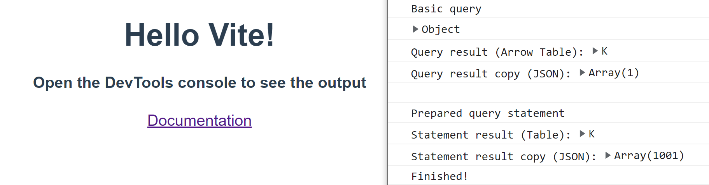

# duckdb-wasm example: vite-browser

Barebones example of querying with duckdb-wasm using Vite and just the browser (no front-end framework). No dataset file is loaded; the data is created using the generate_series function.

## How to run
1. Install the dependencies using `npm i`
2. Run the example using `npm run preview`
3. (Optional) If forking, use `npm run dev` and go from there!

## Steps taken

Everything runs from the [main.js](main.js) script which roughly does the following:

1. Import: duckdb-wasm and all its bundle alternatives
2. Pick bundle: Choose based on the browser in-use
3. Instantiate: Start duckdb and create a connection
4. Query: Select from the "database" (generate_series) using a basic query or a prepared statement
5. Close: The connection, database, and worker.

Notes:
- For ease of use when showing the results, JSON copies of the query results are printed to the console. Consequently...
    - ...this example is not acquainted with proper usage of the Apache Arrow objects like Table.
    - Making JSON copies of large query results for console.log may not be advisable